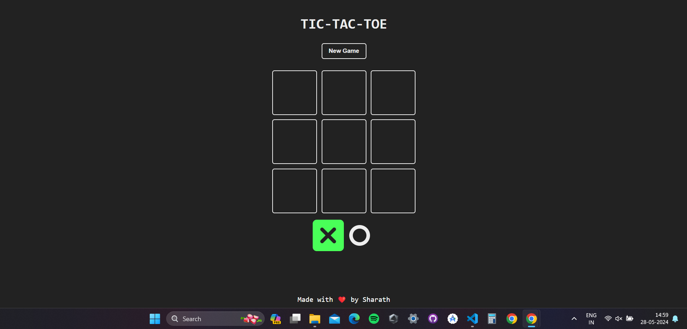

# Tic Tac Toe Game using React

🎮 This is a simple Tic Tac Toe game built using React. It allows two players to take turns marking spaces on a 3x3 grid, to get three of their symbols in a row.

## Technologies Used

🔧 React  
🎨 Framer Motion (for animations)

## Live Demo

🚀 You can try out the live demo [here](#) (replace this with your live link).

## How to Install

To run this project locally, follow these steps:

1. Clone the repository:
